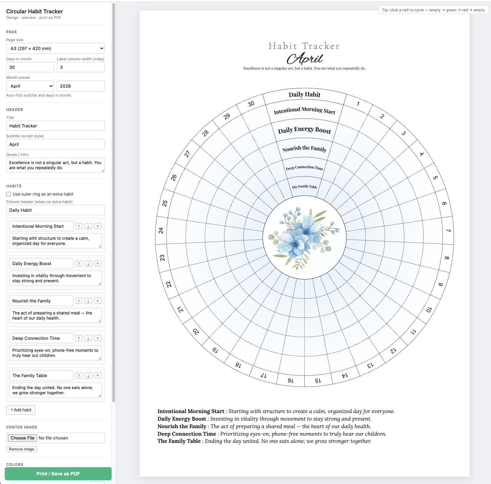

# Circular Habit Tracker

A single-file web app that generates **printable circular habit trackers** — concentric rings for each habit, one cell per day of the month, designed to be printed on A3 / A4 / US Letter paper and filled in by hand (or clicked directly in the browser).



## Features

- **Live SVG preview** that matches the printed output pixel-for-pixel (everything is laid out in millimetres).
- **Fully customizable** from a left sidebar:
  - Page size (A3, A4, Letter)
  - Month / year preset (auto-fills subtitle and the correct number of days — e.g. Feb 2024 → 29, Feb 2026 → 28)
  - Title, script subtitle, intro quote
  - Column-header label ("Daily Habit")
  - Habits: name + description, add / remove / reorder
  - Label-column width (how wide the habit-name column is relative to a day cell)
  - Center image (defaults to `background.jpg`, upload any image to replace)
  - Ring background, "accomplished" color, "skipped" color
- **Click-to-fill cells** — each cell cycles `empty → green → red → empty`.
- **Extra-habit mode** — a checkbox converts the outer day-number ring into an additional colorable habit, replacing the "Daily Habit" header with its name.
- **Auto-save** — the full design (including every filled cell) is persisted in `localStorage` and restored on reload.
- **Print / Save as PDF** via the browser's native print dialog, with `@page { size: A3/A4/Letter; margin: 0 }` for pixel-exact output.

## Usage

Open `index.html` in a modern browser — that's it. No build step, no server, no dependencies beyond Google Fonts (Playfair Display, Lora, Cormorant Garamond, Great Vibes) and a bundled `Alex Brush` TTF for the month subtitle.

To export a PDF:

1. Click **Print / Save as PDF**.
2. In Chrome's print dialog: **Destination** → Save as PDF, **Paper size** → matches the selected page size, **Margins** → Default, **Scale** → Default.

## File layout

```
index.html                           — the entire app (HTML + CSS + JS)
background.jpg                       — default center decoration
fonts/Alex_Brush/                    — script font used for the month subtitle
circular-habit-tracker_april_b_a3.pdf — reference PDF that inspired the layout
screenshot.jpg                       — preview used in this README
```

## How it works (briefly)

- Everything renders into a single `<svg viewBox="0 0 W H">` where **1 user unit = 1 mm**, so SVG coordinates map directly to the printed page.
- The circle is divided into `D + headerWidth` equal angular sectors: `D` day cells and a wider "header" sector at 12 o'clock that holds the habit-name labels.
- Each cell is an SVG annular-wedge path (two arcs + two radial lines).
- Habit names curve along per-ring arcs via `<textPath>` and auto-shrink to fit the label column.
- Empty cells use a `radialGradient` that fades from the ring color near the center to near-white at the outer edge, matching the look of hand-painted trackers.

## License

Personal / educational use.
